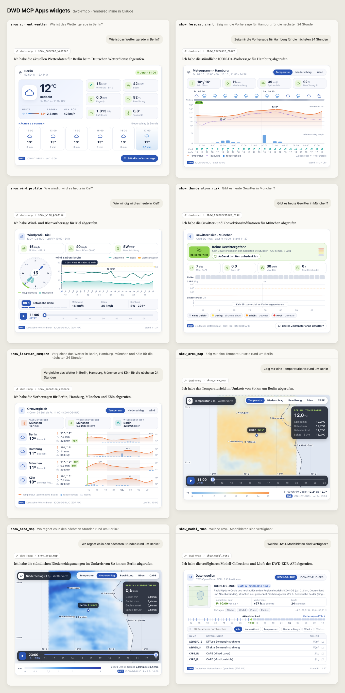
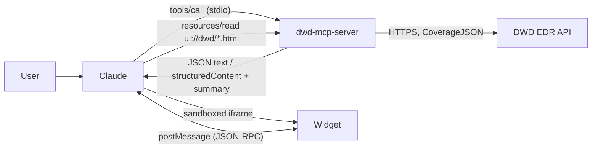

# dwd_rmcp

A Rust [MCP](https://modelcontextprotocol.io) server that gives Claude and other AI clients access to weather
model data from the Deutscher Wetterdienst (DWD). It talks to the DWD
[Environmental Data Retrieval (EDR) API](https://nwp.opendata-api.dwd.de/v1beta1/docs) and needs no API key.

Its default data source is the **ICON-D2-RUC** model. It has a resolution of about 2.2 km, a new run every hour and
forecasts up to about +27 h, covering Germany and its neighbours.

The server offers 17 tools in two groups:

- **Data tools** (10) expose the EDR API: collections, model runs, a parsed point forecast, and raw
  position, radius, area and cube queries.
- **Widget tools** (7, `show_*`) return the same data shaped for display, plus an interactive HTML widget that
  hosts with [MCP Apps](https://github.com/modelcontextprotocol/ext-apps) support, such as Claude Desktop,
  render inline in the chat.



## Contents

- [Tech stack](#tech-stack)
- [Setup](#setup)
- [Run the server](#run-the-server)
- [Use it in Claude](#use-it-in-claude)
- [Tools](#tools)
- [DWD API integration](#dwd-api-integration)
- [How it works](#how-it-works)
- [Project layout](#project-layout)
- [Development](#development)
- [Troubleshooting](#troubleshooting)

## Tech stack

| Area | Choice |
| --- | --- |
| Language | Rust, edition 2024 (Rust 1.85 or newer) |
| MCP SDK | [`rmcp`](https://crates.io/crates/rmcp) 3.5: `#[tool]` macros, tool router, stdio transport |
| Async runtime | `tokio` (multi-threaded) and `futures` for parallel requests |
| HTTP client | `reqwest` 0.12 with JSON, 30 s timeout |
| Data | `serde` / `serde_json` for CoverageJSON, `schemars` for the tool input JSON Schemas, `chrono` for time handling |
| Errors | `anyhow` |
| Transport | stdio (JSON-RPC over stdin/stdout); there is no HTTP endpoint |
| Widgets | Plain HTML, CSS and JavaScript with no framework and no network access, compiled into the binary with `include_str!` |
| Dev tooling | Node 20+ and Playwright for the widget preview and screenshots (optional) |

## Setup

Prerequisites: a Rust toolchain from [rustup](https://rustup.rs). Node is only needed for widget development.

```sh
git clone https://github.com/mario-s/dwd_rmcp.git
cd dwd_rmcp
cargo build --release
cargo test
```

The result is a single self-contained binary, `target/release/dwd-mcp-server`. It takes no arguments, reads no
environment variables, and needs only outbound HTTPS access to `nwp.opendata-api.dwd.de`.

## Run the server

The server speaks MCP over stdio, so it is normally started by an MCP client (see
[Use it in Claude](#use-it-in-claude)). Started on its own, it waits silently for JSON-RPC on stdin:

```sh
cargo run --release
```

To check that it answers, send it a handshake and a tool list request:

```sh
{
  echo '{"jsonrpc":"2.0","id":1,"method":"initialize","params":{"protocolVersion":"2025-06-18","capabilities":{},"clientInfo":{"name":"cli","version":"0"}}}'
  sleep 0.5
  echo '{"jsonrpc":"2.0","method":"notifications/initialized"}'
  echo '{"jsonrpc":"2.0","id":2,"method":"tools/list"}'
  sleep 1
} | ./target/release/dwd-mcp-server
```

For interactive testing, use the [MCP Inspector](https://github.com/modelcontextprotocol/inspector). It lists the
tools and lets you call them with your own arguments:

```sh
npx @modelcontextprotocol/inspector ./target/release/dwd-mcp-server
```

## Use it in Claude

The server registers as `dwd-rmcp` with the title "DWD Wetter (ICON-D2)". Use an absolute path to the binary in
every client.

### Claude Desktop

1. Open **Settings → Developer → Edit config**, or edit the file directly:
   - macOS: `~/Library/Application Support/Claude/claude_desktop_config.json`
   - Windows: `%APPDATA%\Claude\claude_desktop_config.json`
2. Add the server to `mcpServers`, keeping any existing entries:

   ```json
   {
     "mcpServers": {
       "dwd-rmcp": {
         "command": "/absolute/path/to/dwd_rmcp/target/release/dwd-mcp-server"
       }
     }
   }
   ```

3. Fully quit Claude Desktop (⌘Q on macOS) and start it again.
4. **Settings → Developer** should now list `dwd-rmcp` as **Running**. On macOS the server log is
   `~/Library/Logs/Claude/mcp-server-dwd-rmcp.log`.

Claude Desktop keeps the server process running and the widget HTML is compiled into the binary, so after every
`cargo build --release`, quit and restart Claude Desktop.

### Claude Code

```sh
claude mcp add dwd-rmcp -- /absolute/path/to/dwd_rmcp/target/release/dwd-mcp-server
```

Add `--scope project` to write the entry to a shared `.mcp.json` instead. Run `/mcp` in Claude Code to check the
connection. The terminal does not render MCP Apps, so `show_*` tools display their short text summary instead of the
widget.

### Other MCP clients

Any client that can launch a stdio server works. Configure the binary path as the command, with no arguments.

### Example prompts

Ask in German or English. Claude finds the coordinates itself. The server's instructions tell it to prefer the
`show_*` tools when you want to *see* the weather, and the data tools for raw data questions.

| Deutsch | English | Tool used |
| --- | --- | --- |
| Wie ist das Wetter gerade in Berlin? | What's the weather like in Berlin right now? | `show_current_weather` |
| Zeig mir die Vorhersage für Hamburg für die nächsten 24 Stunden | Show me the forecast for Hamburg for the next 24 hours | `show_forecast_chart` |
| Wie windig wird es heute in Kiel? | How windy will it be in Kiel today? | `show_wind_profile` |
| Gibt es heute Gewitter in München? | Will there be thunderstorms in Munich today? | `show_thunderstorm_risk` |
| Vergleiche Berlin, Hamburg, München und Köln | Compare Berlin, Hamburg, Munich and Cologne | `show_location_compare` |
| Wo regnet es in den nächsten Stunden rund um Berlin? | Where will it rain around Berlin in the next few hours? | `show_area_map` |
| Welche DWD-Modelldaten sind verfügbar? | Which DWD model data is available? | `show_model_runs` |
| Gib mir die rohen Temperaturwerte für Frankfurt | Give me the raw temperature values for Frankfurt | `get_point_weather_forecast` |

## Tools

All tools are read-only. Optional arguments are marked with `?`. Unless stated otherwise, `collection_id?` defaults
to `ICON-D2-RUC@single_level`.

### Data tools

These return the DWD response as JSON text, either parsed or close to how the API delivers it.

| Tool | Input | Returns | EDR endpoint |
| --- | --- | --- | --- |
| `get_dwd_api_info` | none | Landing page and links | `GET /` |
| `get_conformance` | none | Supported conformance classes | `GET /conformance` |
| `list_model_collections` | none | Available collections, e.g. `ICON-D2-RUC@single_level` | `GET /collections` |
| `describe_model_collection` | `collection_id?` | Metadata, parameter names, query types | `GET /collections/{id}` |
| `list_model_run_instances` | `collection_id?` | Model runs (instances) | `GET /collections/{id}/instances` |
| `get_point_weather_forecast` | `latitude`, `longitude`, `collection_id?`, `instance_id?`, `parameters?` (list), `datetime_range?` | Parsed hourly series; temperatures also in °C | `position` |
| `query_edr_position` | `coords` (WKT `POINT`), `parameter_names?`, `datetime_val?`, `instance_id?`, `crs?`, `output_format?`, `collection_id?` | Raw CoverageJSON | `position` |
| `query_edr_radius` | `coords`, `within`, `within_units?` (default `km`), plus the `position` options | Raw CoverageJSON | `radius` |
| `query_edr_area` | `coords` (WKT `POLYGON`), plus the `position` options | Raw CoverageJSON | `area` |
| `query_edr_cube` | `bbox` (`minx,miny,maxx,maxy`), plus the `position` options | Raw CoverageJSON | `cube` |

`get_point_weather_forecast` uses the newest run that has data unless `instance_id` is given. Its default
parameters are `T_2M`, `TOT_PREC`, `U_10M`, `V_10M`, `CLCT`, `PMSL` and `WW`. Without an `instance_id`, the raw
`query_edr_*` tools call the collection-level endpoint and leave the choice of run to the API.

### Widget tools

Each `show_*` tool returns display-ready `structuredContent`, a short text summary for the model, and a widget
resource `ui://dwd/<name>.html`. The widgets are in German, follow the host's light or dark theme, and load nothing
from the network.

| Tool | Input | Shows |
| --- | --- | --- |
| `show_current_weather` | `latitude`, `longitude`, `location_name?`, `collection_id?`, `instance_id?` | Current conditions, key figures, the next 6 hours |
| `show_forecast_chart` | the same, plus `hours?` (default 24, max 48) | Hourly meteogram: temperature, dew point, rain, clouds, wind, pressure |
| `show_wind_profile` | the same as `show_forecast_chart` | Wind speed, gusts, direction, Beaufort, prevailing direction |
| `show_thunderstorm_risk` | the same as `show_forecast_chart` | Hourly risk level from CAPE, lightning potential, hail, gusts and weather code |
| `show_location_compare` | `locations` (2–6 × `{name?, latitude, longitude}`), `hours?`, `collection_id?` | Places side by side on shared scales |
| `show_area_map` | `bbox?` or `latitude` + `longitude` + `radius_km?` (default 60, max 250), `parameter?`, `hours?` (default 12, max 24), `location_name?` | Gridded field with a time slider |
| `show_model_runs` | `collection_id?`, `limit?` (default 24) | Collections, runs, forecast range and parameters |

Set `collection_id` to `ICON-D2-RUC-EPS@single_level` to get the ensemble mean instead. Screenshots of every
widget, their behaviour, and how to add a new one are in **[docs/widgets.md](docs/widgets.md)**. The payload shapes
are specified in [widgets/CONTRACT.md](widgets/CONTRACT.md).

## DWD API integration

- **Base URL:** `https://nwp.opendata-api.dwd.de/v1beta1` (OGC API – EDR, beta). It is open data and needs no key.
- **Format:** every data request asks for `f=CoverageJSON`. Coordinates are WGS84 longitude/latitude, for example
  `POINT(13.405 52.520)`.
- **Domain:** ICON-D2 covers roughly 43–58° N and 4° W–20.5° E. Points outside it return no data.

### Collections

| Collection | Use |
| --- | --- |
| `ICON-D2-RUC@single_level` | Default. Deterministic rapid-update run, hourly, about +27 h |
| `ICON-D2-RUC-EPS@single_level` | Ensemble mean. Has no `WW` weather code, so those fields come back `null` |

`list_model_collections` and `show_model_runs` list everything else the API offers.

### Parameters used

| Parameter | Meaning | Converted to |
| --- | --- | --- |
| `T_2M`, `TD_2M` | Temperature and dew point at 2 m (K) | °C |
| `TOT_PREC` | Accumulated precipitation since run start (kg/m²) | mm per hour (de-accumulated) |
| `CLCT` | Total cloud cover | % |
| `U_10M`, `V_10M` | Wind components at 10 m (m/s) | km/h, direction and Beaufort |
| `VMAX_10M` | Maximum gust at 10 m (m/s) | km/h |
| `PMSL` | Mean sea-level pressure (Pa) | hPa |
| `WW` | Present weather code | icon and label |
| `CAPE_ML`, `LPI`, `HAIL_GSP` | Convective energy, lightning potential index, hail | thunderstorm risk level |

The widget tools first check which parameters a collection offers and request only those.

### How requests are made

- **Run selection.** DWD's `/instances` list is not in chronological order. The server sorts run ids newest first,
  then probes up to 4 of them with a single-point `T_2M` request and uses the first that returns values. If none
  does, it falls back to the newest id.
- **Point series.** Parameters are requested in parallel groups: 3 per request, or 1 per request for the ensemble,
  where the cost of each request grows with the number of parameters. The groups are merged on a shared time axis.
- **Comparisons.** All places are fetched in parallel from the same run.
- **Area maps.** Regions up to about 9,000 km² use a single `cube` request. The API limit is 10,000 km², so larger
  regions are sampled with `MULTIPOINT` position queries in chunks of 700 points. The triangular ICON grid is mapped
  onto a regular grid of at most about 48,000 values.
- **Errors.** HTTP errors are reported with the API's problem+json `detail`. The data tools return them as
  `DWD API error: …` text.

### Caching

The cache is in memory and lasts as long as the server process.

| What | TTL |
| --- | --- |
| Instance list per collection | 2 min |
| Selected newest run per collection | 2 min |
| Collection metadata (parameter names) | 10 min |
| Forecast data | not cached |

## How it works



1. Claude calls a tool over stdio. `src/main.rs` routes data tools to `src/dwd_client.rs`, and `show_*` tools to
   `src/show_tools.rs`.
2. The client fetches CoverageJSON from the EDR API. For widget tools, `src/shaping.rs` converts units, builds
   hourly steps and summaries, rates the thunderstorm risk and builds the map grid.
3. A `show_*` tool declares its widget in `_meta.ui.resourceUri`. A host with MCP Apps support reads that resource
   (`text/html;profile=mcp-app`) and renders it in a sandboxed iframe. The widget gets the tool result through
   `widgets/shared/bridge.js`, and can call tools again or post a follow-up message into the chat.

## Project layout

```
src/
  main.rs          MCP server: server info and instructions, data tools, widget resources
  dwd_client.rs    EDR API client: endpoints, run selection, caching
  show_tools.rs    the seven show_* widget tools
  shaping.rs       unit conversion, steps and summaries, storm risk, grid sampling
  widgets.rs       widget registry, ui:// resources, tool _meta
widgets/
  <name>.html      one self-contained widget per file
  shared/          bridge.js (MCP Apps client) and theme.css (DWD design tokens)
  fixtures/        live sample payloads; scenarios/ holds hand-written demo data
  preview/         local host emulator and screenshot capture
  dev/snap.mjs     render one widget with its fixture
  CONTRACT.md      tool names, arguments, payload shapes
docs/
  widgets.md       full widget documentation
  screenshots/     light and dark screenshots
```

## Development

```sh
cargo test                                   # unit tests: conversions, wind direction, risk rules, grid, widgets
cargo build --release                        # then restart the MCP client

node widgets/dev/snap.mjs forecast dark 640  # render one widget → widgets/dev/out/
node widgets/preview/serve.mjs [--live]      # preview host → http://localhost:5178
node widgets/preview/capture.mjs --live      # screenshots from the real binary → docs/screenshots/
```

The preview tools need Node 20+ and Playwright. See [widgets/preview/README.md](widgets/preview/README.md).

To add a data tool, add a client method in `src/dwd_client.rs` and a `#[tool]` method in `src/main.rs`. To add a
widget, follow [docs/widgets.md](docs/widgets.md#adding-a-new-widget).

## Troubleshooting

| Problem | Fix |
| --- | --- |
| `dwd-rmcp` is missing from Claude Desktop | Check the absolute path in `claude_desktop_config.json`, then fully quit and restart the app. |
| Server shows as failed | Read `~/Library/Logs/Claude/mcp-server-dwd-rmcp.log`, and make sure the binary exists and is executable. |
| Widgets don't appear or look outdated | Rebuild, then fully quit and restart Claude Desktop. |
| Only text, no widget | The host doesn't support MCP Apps. The text summary is the expected fallback. |
| "no model data" for a location | The point is outside the ICON-D2 domain (roughly 43–58° N, 4° W–20.5° E). |
| Forecast stops after about a day | Each RUC run reaches only about +27 h, so `hours` up to 48 is effectively capped. |
| Area map request rejected | Use a smaller `radius_km` (max 250) or `bbox`. |

## Data source

Weather data: [Deutscher Wetterdienst Open Data](https://opendata.dwd.de), via the
[EDR API](https://nwp.opendata-api.dwd.de/v1beta1/docs). Credit "Quelle: Deutscher Wetterdienst" when you show it.
All values are model forecasts, not observations.
