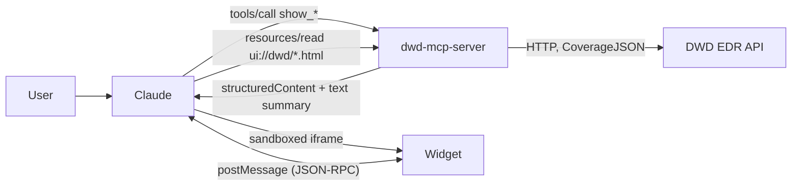

# dwd_rmcp

A Rust MCP server for the Deutscher Wetterdienst (DWD). It uses the DWD
[Environmental Data Retrieval (EDR) API](https://nwp.opendata-api.dwd.de/v1beta1/docs) with the
ICON-D2-RUC model: about 2.2 km resolution, a new run every hour, forecasts up to about +27 h, covering
Germany and its neighbours.

The server offers two kinds of tools:

- **Interactive weather widgets.** Seven `show_*` tools return a small HTML app that Claude renders
  inline in the chat ([MCP Apps](https://github.com/modelcontextprotocol/ext-apps)): current conditions,
  a meteogram, wind, thunderstorm risk, a city comparison, a gridded map and a model-run explorer.
- **Raw data tools** that expose the EDR API directly (collections, model runs, position, radius, area
  and cube queries).


## Contents

- [Quick start](#quick-start)
- [Widgets](#widgets)
- [Data tools](#data-tools)
- [How it works](#how-it-works)
- [Project layout](#project-layout)
- [Development](#development)
- [Troubleshooting](#troubleshooting)

## Quick start

### Build

```sh
cargo build --release
```

The binary is `target/release/dwd-mcp-server`. It talks MCP over stdio and needs no arguments or API key.

### Claude Desktop

Add the server to `claude_desktop_config.json`. On macOS the file is at
`~/Library/Application Support/Claude/claude_desktop_config.json`, and on Windows at
`%APPDATA%\Claude\claude_desktop_config.json`.

```json
{
  "mcpServers": {
    "dwd-rmcp": {
      "command": "/path/to/dwd_rmcp/target/release/dwd-mcp-server"
    }
  }
}
```

Then **fully quit and restart Claude Desktop**, and do so again after every rebuild. The widget HTML is
compiled into the binary, and Claude Desktop keeps the server process running.

### Claude Code and other MCP clients

```sh
claude mcp add dwd-rmcp -- /path/to/dwd_rmcp/target/release/dwd-mcp-server
```

Hosts without MCP Apps support, such as Claude Code in the terminal, call the same `show_*` tools but
display only the short text summary each tool returns instead of the widget.

### Try it

Ask in German or English. Claude works out the coordinates itself, and the server's instructions tell it
to prefer the `show_*` tools when you want to *see* the weather.

| Widget | Deutsch | English |
|---|---|---|
| `show_current_weather` | Wie ist das Wetter gerade in Berlin? | What's the weather like in Berlin right now? |
| `show_forecast_chart` | Zeig mir die Vorhersage für Hamburg für die nächsten 24 Stunden | Show me the forecast for Hamburg for the next 24 hours |
| `show_wind_profile` | Wie windig wird es heute in Kiel? | How windy will it be in Kiel today? |
| `show_thunderstorm_risk` | Gibt es heute Gewitter in München? | Will there be thunderstorms in Munich today? |
| `show_location_compare` | Vergleiche das Wetter in Berlin, Hamburg, München und Köln | Compare the weather in Berlin, Hamburg, Munich and Cologne |
| `show_area_map` | Wo regnet es in den nächsten Stunden rund um Berlin? | Where will it rain around Berlin in the next few hours? |
| `show_model_runs` | Welche DWD-Modelldaten sind verfügbar? | Which DWD model data is available? |

## Widgets

The widgets are in German, with `de-DE` number formats and times in `Europe/Berlin`. They follow the
host's light or dark theme and adapt to widths from about 360 to 760 px. All screenshots below were
captured from live data (ICON-D2-RUC run 2026-10-09 08:00 UTC) with `widgets/preview/capture.mjs --live`,
in a page that mimics Claude's chat; GitHub shows the dark variant when it is in dark mode. Full details,
including every screenshot in both themes, are in **[docs/widgets.md](docs/widgets.md)**.

Optional arguments are marked with `?`. The `collection_id?` and `instance_id?` arguments default to
`ICON-D2-RUC@single_level` and the newest run that has data.
`ICON-D2-RUC-EPS@single_level` gives the ensemble mean instead.

### Current weather: `show_current_weather`

`latitude`, `longitude`, `location_name?`, `collection_id?`, `instance_id?`

Current conditions with a weather icon and the temperature. Six key figures: wind with Beaufort and
direction, gusts, rain per hour, cloud cover, pressure and dew point. Below them, today's range, an
hour-by-hour strip for the next 6 hours, and a button that asks Claude for the hourly chart.

<picture>
  <source media="(prefers-color-scheme: dark)" srcset="docs/screenshots/current-dark.png">
  
</picture>

### Forecast / meteogram: `show_forecast_chart`

`latitude`, `longitude`, `location_name?`, `hours?` (default 24, max 48), `collection_id?`, `instance_id?`

Hourly meteogram:

- **Chart:** temperature with dew point, rain bars, a cloud band, weather icons, wind arrows and a "Jetzt" (now) marker.
- **Modes:** a switch emphasises temperature, rain or wind.
- **Inspection:** hover, tap or the arrow keys show every value for one hour.

<picture>
  <source media="(prefers-color-scheme: dark)" srcset="docs/screenshots/forecast-dark.png">
  
</picture>

### Wind: `show_wind_profile`

`latitude`, `longitude`, `location_name?`, `hours?` (default 24, max 48), `collection_id?`, `instance_id?`

Wind and gusts:

- **Compass rose** with the prevailing direction and the Beaufort scale.
- **Chart** of mean wind and gusts against the warning thresholds (50, 65 and 90 km/h).
- **Time scrubber** with play/pause.

<picture>
  <source media="(prefers-color-scheme: dark)" srcset="docs/screenshots/wind-dark.png">
  
</picture>

### Thunderstorm risk: `show_thunderstorm_risk`

`latitude`, `longitude`, `location_name?`, `hours?` (default 24, max 48), `collection_id?`, `instance_id?`

Convection outlook:

- **Risk level:** 0 to 3, shown in DWD warning colours.
- **Peak time and advice:** when the risk peaks, with a plain-German tip such as "Außenarbeiten 14–18 Uhr verschieben".
- **Hourly strip:** one coloured cell per hour.
- **Charts:** CAPE and lightning potential index (LPI).

Each hour's risk comes from the first matching rule:

| Level | Rule |
|---|---|
| 3 | WW ≥ 95, LPI ≥ 4, gusts ≥ 90 km/h or CAPE ≥ 2000 J/kg |
| 2 | LPI ≥ 2, gusts ≥ 65 km/h or CAPE ≥ 1000 J/kg |
| 1 | LPI > 0, CAPE ≥ 300 J/kg or gusts ≥ 50 km/h |
| 0 | otherwise |

The day of the live capture was calm (left). The right-hand image is an **illustrative scenario** made
from hand-written data in `widgets/fixtures/scenarios/storm.json`, to show what an afternoon thunderstorm looks like.

<p>
  
  
</p>

### Location comparison: `show_location_compare`

`locations` (2–6 × `{ name?, latitude, longitude }`), `hours?` (default 24, max 48), `collection_id?`

Several places side by side:

- **Highlights:** the warmest, driest and windiest place.
- **One row per place** with a sparkline on a shared time axis and scale.
- **Metric switch:** temperature, rain or wind.
- **Synchronised cursor** across all rows.

<picture>
  <source media="(prefers-color-scheme: dark)" srcset="docs/screenshots/compare-dark.png">
  
</picture>

### Area map: `show_area_map`

`bbox?` (`"minx,miny,maxx,maxy"`) **or** `latitude` + `longitude` + `radius_km?` (default 60, max 250),
`parameter?` (`T_2M` default, `TOT_PREC`, `CLCT`, `VMAX_10M`, `CAPE_ML`), `hours?` (default 12, max 24), `location_name?`

A gridded field over a region, drawn on a canvas:

- **Map:** an outline of Germany, cities and markers, with the value under the cursor on hover.
- **Time slider** with play/pause.
- **Colour legend** and an info panel with the area's minimum, maximum and mean.
- **Parameter switch** at the top: the widget calls the tool again for the chosen field.

<picture>
  <source media="(prefers-color-scheme: dark)" srcset="docs/screenshots/area-map-dark.png">
  
</picture>

<picture>
  <source media="(prefers-color-scheme: dark)" srcset="docs/screenshots/area-map-precip-dark.png">
  
</picture>

### Model runs: `show_model_runs`

`collection_id?` (default: all collections), `limit?` (runs per collection, default 24)

The model collections the API offers, one tab each:

- **Coverage:** a small map of the area the collection covers.
- **Timeline:** recent runs, with the newest marked and the forecast horizon after it.
- **Query types:** the request types the collection supports (position, radius, area, cube).
- **Parameters:** a searchable table. Clicking a parameter asks Claude to explain it.

<picture>
  <source media="(prefers-color-scheme: dark)" srcset="docs/screenshots/model-runs-dark.png">
  
</picture>

## Data tools

These return JSON from the EDR API more or less as delivered:

| Tool | Purpose |
|---|---|
| `get_dwd_api_info` | API landing page and links |
| `get_conformance` | Conformance classes |
| `list_model_collections` | Available collections, e.g. `ICON-D2-RUC@single_level` |
| `describe_model_collection` | Metadata, parameter names and query types of one collection |
| `list_model_run_instances` | Model runs (instances) of a collection |
| `get_point_weather_forecast` | Parsed point forecast (temperature, precipitation, wind, clouds, pressure, weather code) |
| `query_edr_position` / `query_edr_radius` / `query_edr_area` / `query_edr_cube` | Raw CoverageJSON for a point, radius, polygon or bounding box |

## How it works



1. Each `show_*` tool declares its widget in `_meta.ui.resourceUri`, e.g. `ui://dwd/forecast.html`.
2. The host loads that resource (`text/html;profile=mcp-app`) and renders it in a sandboxed iframe. The
   widgets load nothing from the network: no CDNs, fonts or map tiles.
3. The tool result carries the display-ready data as `structuredContent` and a short text summary for
   the model. The widget receives the result through `widgets/shared/bridge.js` and can call tools on
   this server itself, for example to switch the map parameter, or post a follow-up message into the chat.

What happens to the data:

- **Run selection.** The server uses the newest run that actually returns data. DWD's `/instances` list
  is not in chronological order, so it picks the highest run id and checks it, trying up to 4 runs. The
  result is cached for 2 minutes.
- **Units.** Values are converted for display: K → °C, Pa → hPa, U/V wind → km/h and direction, and
  accumulated precipitation → mm per hour. Steps start at the current hour.
- **Area maps.** Regions up to about 9,000 km² use a single EDR `cube` request. The API limit is
  10,000 km², so larger regions are sampled with batched MULTIPOINT position queries.
- **Grid.** The triangular ICON grid is mapped onto a regular grid of at most about 48,000 values, which
  keeps a payload around 260 KB.
- **Ensemble.** `ICON-D2-RUC-EPS` has no `WW` weather code, so those fields come back `null`.

The JSON shape of every widget payload is specified in [`widgets/CONTRACT.md`](widgets/CONTRACT.md), and
explained in more depth in [docs/widgets.md](docs/widgets.md).

## Project layout

```
src/
  main.rs          MCP server: data tools, resources, server info
  show_tools.rs    the seven show_* widget tools
  shaping.rs       unit conversion, steps and summaries, storm risk, grid sampling
  widgets.rs       widget registry, ui:// resources, tool _meta
  dwd_client.rs    EDR API client, run selection, caching
widgets/
  <name>.html      one self-contained widget per file (compiled in with include_str!)
  shared/          bridge.js (MCP Apps client) and theme.css (DWD design tokens)
  fixtures/        live sample payloads; scenarios/ holds hand-written demo data
  preview/         local host emulator, screenshot capture
  dev/snap.mjs     render one widget with its fixture
  CONTRACT.md      tool names, arguments, payload shapes
docs/
  widgets.md       full widget documentation
  screenshots/     light/dark screenshots and gallery
```

## Development

```sh
cargo test                                       # unit tests (conversions, wind direction, risk rules, grid)
cargo build --release

node widgets/dev/snap.mjs forecast dark 640      # quick render of one widget → widgets/dev/out/
node widgets/preview/serve.mjs [--live]          # interactive preview host → http://localhost:5178
node widgets/preview/capture.mjs --live          # screenshots from the real binary → docs/screenshots/
node widgets/preview/capture.mjs --live --update-fixtures   # also refresh widgets/fixtures/
```

The preview tools need Node 20+ and Playwright. See [widgets/preview/README.md](widgets/preview/README.md).

To add a widget:

1. Write `widgets/<name>.html` with the `<!--DWD:SHARED-->` marker in `<head>`.
2. Register it in `src/widgets.rs`.
3. Add a `show_*` tool in `src/show_tools.rs` with the widget's `_meta`.
4. Describe its payload in `widgets/CONTRACT.md` and add a fixture.

The full steps are in [docs/widgets.md](docs/widgets.md#adding-a-new-widget).

## Troubleshooting

- **Widgets don't appear or look outdated:** rebuild, then fully quit and restart Claude Desktop.
- **Only text, no widget:** the host doesn't support MCP Apps. The text summary is the expected fallback.
- **Error for a location:** ICON-D2 covers only Germany and its neighbours (roughly 43–58° N, 4° W–20.5° E).
- **Short forecasts:** each RUC run reaches only about +27 h, so `hours` up to 48 is effectively capped.
